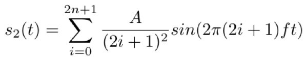

# Exercise 1

## Asignee

Phan Anh Dương - 15021924

## Problem

> Cho trước các thông số (khai báo thành các biến)
>
> - f: Tần số cơ bản
> - fs: tần số lấy mẫu
> - N: số chu kỳ tín hiệu cần vẽ tính với tần số cơ bản f
> - A: Biên độ của tín hiệu cơ bản
> - n : một giá trị nguyên
>
> **Yêu cầu**
> Viết các chương trình python thực hiện công việc sau:
>
> - Vẽ đồ thị dạng sóng (theo thời gian) của tín hiệu:
>
>   ```text
>   s1(t) = A sin(2pi f t)
>   ```
>
> - Vẽ đồ thị dạng sóng (theo thời gian) của tín hiệu
>
> 
>
> - Các đồ thị lưu dưới dạng file ảnh.
