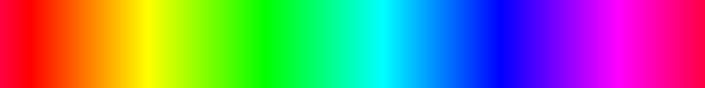

# Exercise 5

## Assignee

Nguyễn Việt Minh Nghĩa - 15021358

## Problem

> Hãy viết các chương trình sinh ra các ảnh sau:
>
> - Bàn cờ vua gồm các ô đen trắng đan xen.
> - Dải màu biến đổi tuần tự theo chiều ngang từ đỏ đến tím (gợi ý, có thể sử dụng hệ màu khác RGB, ví dụ HSL).
> - Dải màu biến đổi tuần tự theo chiều dọc từ đỏ đến tím.
> - Dải màu biến đổi tuần tự theo chiều chéo từ đỏ đến tím.

## Solution

### 1. Checkerboard generator

#### 1. Run

```bash
# Install Pillow
$ pip install -r requirements.txt
...

# Generate an 8x8 board
$ python checkerboard.py
...

# Options
$ python checkerboard.py -h
usage: checkerboard.py [-h] [-c C] [-r R] [-s S] [O]

Generate checkerboard pattern.

positional arguments:
  O                 Output filename (default checkerboard.png)

optional arguments:
  -h, --help        show this help message and exit
  -c C, --column C  Number of column (default 8)
  -r R, --row R     Number of row (default 8)
  -s S, --ssize S   Size of each square (default 50 px)
```

#### 2. Preview


### 2. Gradient generator

#### 1. Run

```bash
# Generate a horizontal gradient
$ python gradient.py
...

# Options
$ python gradient.py -h
usage: Generate gradient. [-h] [-D [{horizontal,vertical,diagonal}]] [-W W]
                          [-H H] [-O O] [-P]

optional arguments:
  -h, --help            show this help message and exit
  -D [{horizontal,vertical,diagonal}], --direction [{horizontal,vertical,diagonal}]
                        Gradient direction: horizontal, vertical, diagonal.
                        Default is horizontal (default output 1600x200).
                        Vertical default outputs 200x1600. Diagonal default
                        outputs 800x800.
  -W W, --width W       Output width
  -H H, --height H      Output height
  -O O, --output O      Output filename (default gradient.direction.png)
  -P, --perceptual      Default starting hue of red is 0 degree. This option
                        moves it to 354 degree for perceptual "red".
```

#### 2. Preview

Default:


Perceptual:



#### 3. Note about starting hue of red

In HSV color wheel, pure red starts at 0 degree of hue. However, perceptually, hue values close to 360 degree are also considered "red". According to the colors listed on [this Wiki article](https://en.wikipedia.org/wiki/Shades_of_red), red could start at 345 degree hue.

The `-P` flag enables this mode.
